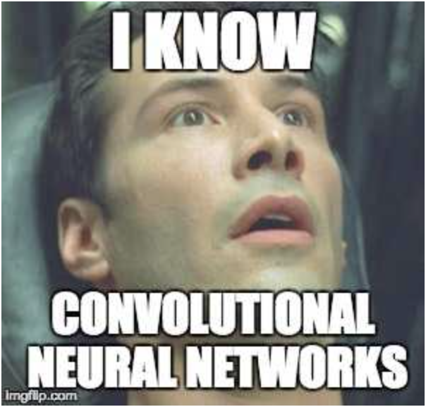

# CNN Engine in Pure NumPy

##  Meme Motivation

*After this project, I can say* 

---

##  About the Project

This mini-project is a minimalistic implementation of **Convolutional Neural Networks (CNNs)** built entirely from scratch using **NumPy**. I didn’t rely on any deep learning libraries like TensorFlow or PyTorch, the idea was to understand **how CNNs works**, including both **forward and backward passes**.

---

## 📌 What’s Inside

### 1) Zero Padding
Implemented a `zero_pad()` function to pad the input images symmetrically with zeros to preserve spatial dimensions before applying convolution.

### 2) Single-Step Convolution
`conv_single_step()` performs element-wise multiplication of a small filter on a region of the input, this is the core step behind convolution.

### 3) Full Convolution Forward Pass
`conv_forward()` handles a batch of inputs and filters to apply convolution operation over height, width, and channels. It also supports stride and padding hyperparameters.

### 4) Pooling Forward Pass
`pool_forward()` supports both `max` and `average` pooling, reducing dimensionality while preserving features.

### 5) Convolution Backward Pass
`conv_backward()` backpropagates through the convolution layer and calculates the gradients w.r.t. input, weights, and biases. Fully vectorized and compatible with batch inputs.

### 6) Max Masking for Backprop
`create_mask_from_window()` was used in the pooling backward pass to identify the max element during backpropagation.

### 7) Distribute Gradients for Average Pooling
`distribute_value()` helps in spreading the gradient equally during average pooling backward pass.

### 8) Pooling Backward Pass
`pool_backward()` completes the cycle by implementing backward propagation through both max and average pooling layers.

---

##  Tech Stack

- Python
- NumPy
- No frameworks 😎

---

## 💡 Usage

This project is great for:
- Learning the internals of CNNs
- Building intuition for backpropagation
- Interview prep
- Academic assignments

---

